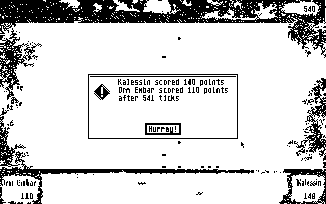

Midisurf
================

Midisurf is an Audiosurf/GuitarHero-like game for the Atari ST based on Midi files. At the start of the game, a Midi file from disk has to be selected. This Midi file is being played on the Atari ST YT sound-chip, while the player of the game has to press keys on the keyboard at the right time to 'play along' the Midi track.

Playing Midisurf
-------------

The game features two dragons from the Earthsea lore by Ursula K. Le Guin: 'Kalessin' and 'Orm Embar'. These dragons can score points by picking up notes from the Midi track as they are played, and can move left and right to do so:

    * Press '<' to move Kalessin left
    * Press '>' to move Kalessin right
    * Press 'x' to move Orm Embar left
    * Press 'c' to move Orm Embar right

The two dragons can be controlled by a single player or by two players on a single Atari ST, as scores are counted separately for them. The game can be stopped by pressing the escape key.

The Atari ST's sound-chip has three channels, and as such Midisurf was implemented to work with at most three Midi tracks. If a Midi file has more tracks, the player is asked to select the tracks he or she wants to use for the game.

Example Midi tracks that work well with the game are provided in the `testmidi` subfolder, see [here](testmidi/README.md) for more information.

An example of what the game looks like:

Or watch the [Midisurf gameplay video](docs/gameplay.mp4).

Limitations
-------------

The game is currently limited in the following ways:

* It only runs on an Atari ST with a high-resolution (640x400 black & white) screen

* Tunes are most recognizable with just the main Midi track and notes playing, so it is recommended to remove any background Midi tracks and supporting keys upfront, e.g. using a tool like [MidiEditor](https://www.midieditor.org/)

* Certain features of Midi tracks are not supported yet and parsing those tracks will result in an error

* The Atari ST sometimes needs a reboot after the game is ended - unclear why this needed

Compilation
-------------

Midisurf can be cross-compiled on a modern UNIX/Windows system with the [freemint Atari-ST GCC compiler](https://github.com/freemint/m68k-atari-mint-gcc) as follows:

    m68k-atari-mint-gcc src/*.c -o midisurf.prg -lgem

That however results in a relatively large binary (~160KB), so alternatively with [mfro0's libcmini](https://github.com/mfro0/libcmini) (v0.491 has bugs so use the master branch or a newer version when released) you can obtain a binary of around 35KB:

    m68k-atari-mint-gcc -nostdlib $LIBCMINI/startup.o src/*.c -o midisurf.prg -s -L$LIBCMINI -lcmini -lgcc -lgem

When running it on the Atari ST or an emulator, make sure you run it as a GEM application rather than TOS (otherwise the mouse won't show).

Alternatively, for development and debugging purpose (to some extent), it can be compiled and run (but without graphics, audio or gameplay) on a UNIX system by setting the `UNIX` define. For convenience, this can be done with CMake, e.g.:

    mkdir build && cd build
    cmake ..
    make
    ./midisurf

For debugging purpose, Clang's address sanitizer can be used on a UNIX system to check for overflows and memory leaks by compiling and running as follows:

    clang -g -fsanitize=address -fno-omit-frame-pointer -DUNIX src/*.c -o midisurf.unix && ./midisurf.unix && rm midisurf.unix

Running Midisurf on an emulator
-------------

If you don't own an Atari ST or just want to test the game first before you write it to a floppy disk, you can run Midisurf on an Atari ST emulator such as [Hatari](https://hatari.tuxfamily.org/). After setting up the emulator, select the high resolution screen (640x400), and then either:

* Mount one of the Atari ST image releases (`mdsrf_X.Y.st`) as floppy A or B

* Mount the contents of one of the release archives (`mdsrf_X.Y.zip`) as a hard disk

* Compile your own `midisurf.prg` from the repository and mount the folder as a hard disk along with the other files in this repository (at least *.bpm and *.rsc).
